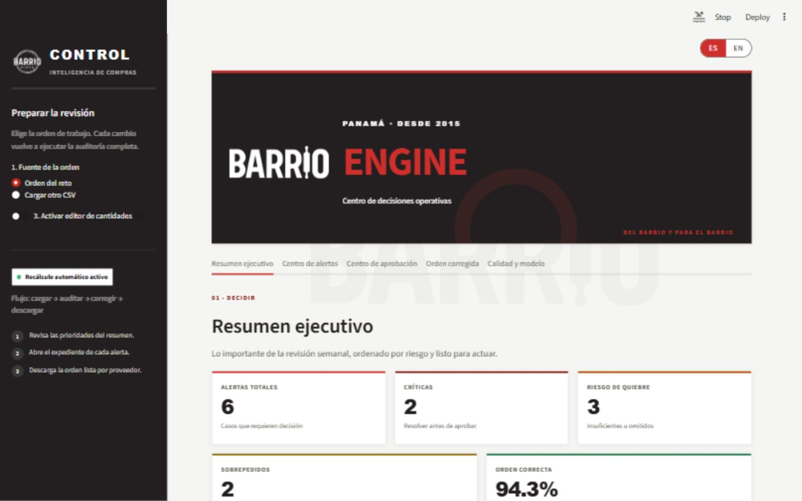
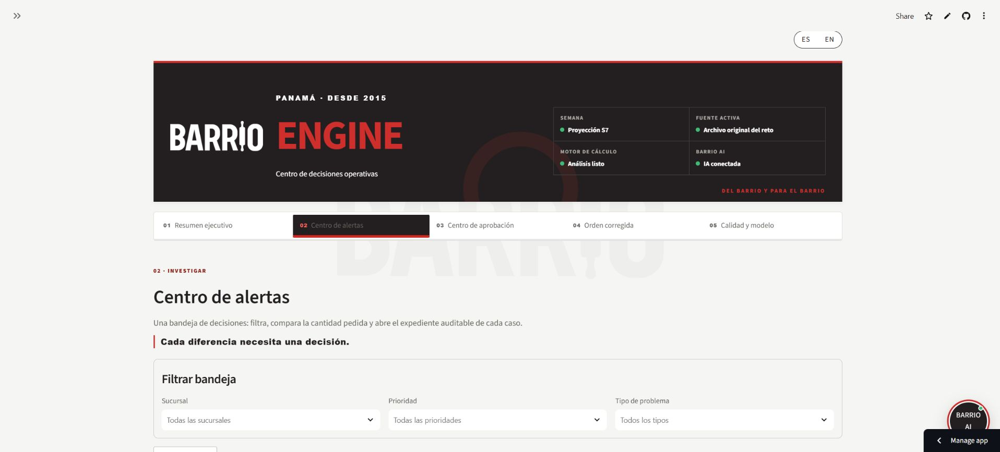
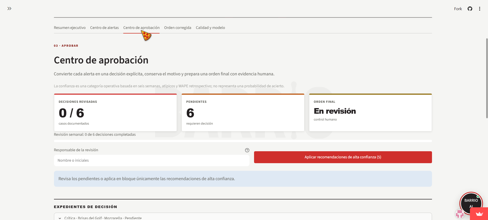
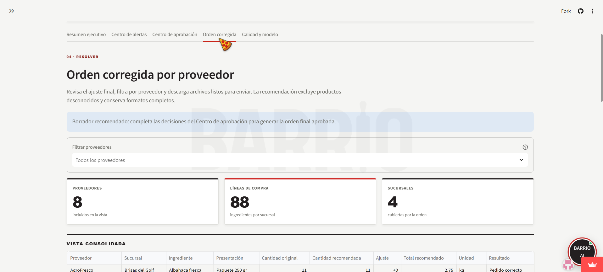
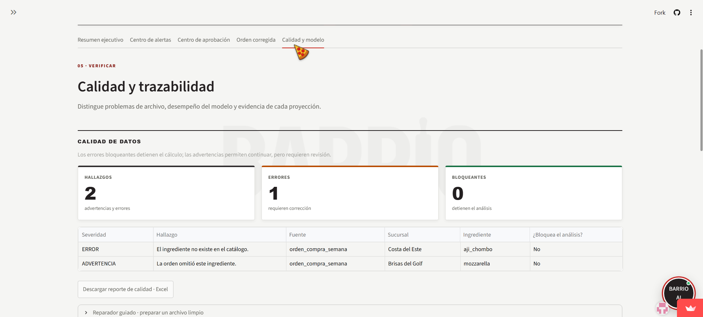
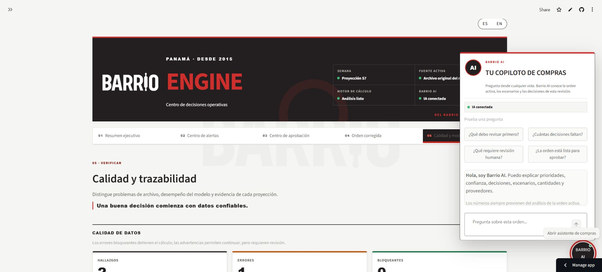
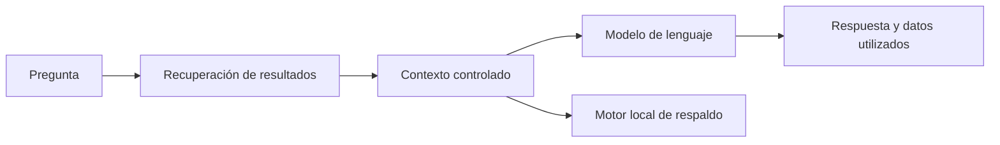
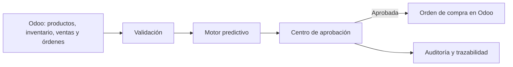

# BARRIO PIZZA — BARRIO ENGINE

<p align="center">
  
</p>

<p align="center">
  Centro de decisiones operativas.
</p>

<p align="center">
  
  
  
  
</p>

> **Aplicación en vivo:** [Abrir BARRIO ENGINE](https://barrio-pizza-compras-inteligentes.streamlit.app/)
>
> **Repositorio público:** [ESPINOSARICHARD/barrio-pizza-compras-inteligentes](https://github.com/ESPINOSARICHARD/barrio-pizza-compras-inteligentes)

## El problema que resuelve

Cada semana las sucursales de Barrio Pizza preparan órdenes de compra. Revisarlas manualmente producto por producto consume tiempo y puede dejar pasar:

- pedidos insuficientes y riesgo de quiebre;
- sobrepedidos, capital inmovilizado y posible merma;
- ingredientes omitidos;
- identificadores que no existen en el catálogo;
- errores de formato, unidades o integridad de los archivos.

La aplicación convierte esa revisión en un flujo operativo auditable: primero valida los datos, luego proyecta el consumo, calcula la necesidad real, compara la orden, prioriza los problemas y acompaña a la gerente hasta una orden aprobada por proveedor.


## Propuesta de valor

El dashboard no se limita a señalar que una orden está mal. Permite comprender el motivo, revisar la evidencia, decidir qué hacer y dejar registro de la decisión.

- **Decisión rápida:** muestra las alertas totales, críticas y la primera acción recomendada.
- **Cálculo verificable:** cada cantidad puede rastrearse hasta histórico, inventario, formato y método de proyección.
- **Supervisión humana:** la gerente puede aplicar la recomendación, mantener la orden con motivo, devolver el caso o separar un problema de catálogo.
- **Cierre operativo:** genera la orden aprobada, la bitácora y mensajes listos para proveedores y sucursales.
- **IA fundamentada:** Barrio AI explica resultados ya calculados; no inventa cantidades ni sustituye el motor de compras.

## Uso de IA
- [Explicación completa del uso de IA](docs/uso-de-ia.md)

## Demostración visual

### Resumen ejecutivo



### Centro de alertas



### Centro de aprobación



### Orden y comunicación por proveedor



### Calidad y trazabilidad del modelo



### Barrio AI



## Funciones principales

### Requisitos obligatorios

- Proyección de la próxima semana por sucursal e ingrediente.
- Cálculo de necesidad real usando inventario actual.
- Conversión entre unidades base y formatos completos de compra.
- Detección de pedidos insuficientes, sobrepedidos e ingredientes omitidos.
- Dashboard visual con alertas claras y accionables.
- Tratamiento correcto del redondeo por formato completo.

### Capacidades adicionales implementadas

- Selección adaptativa del método de proyección.
- Detección de semanas atípicas y backtesting retrospectivo.
- Bandeja de alertas con filtros y expediente auditable.
- Carga de otra orden CSV y editor de cantidades con recálculo automático.
- Centro de aprobación con decisiones, motivos, responsable y bitácora.
- Confianza operativa y aplicación masiva solo para casos de alta confianza.
- Simulador temporal de variaciones de demanda.
- Reparador guiado de archivos sin correcciones silenciosas.
- Libros Excel filtrables, ordenados por proveedor y acompañados de mensajes en texto legible.
- Interfaz completa en español e inglés.
- Barrio AI disponible desde cualquier vista, con respaldo local.

## Resultado con los datos originales

La auditoría base produce **6 alertas** sin modificar los archivos originales:

| Prioridad | Sucursal | Ingrediente | Resultado | Solicitado | Recomendado |
|---|---|---|---|---:|---:|
| Crítica | Brisas del Golf | Mozzarella | Ingrediente omitido | 0 cajas | 18 cajas |
| Crítica | Costa del Este | `aji_chombo` | No evaluable | 3 formatos | — |
| Alta | Costa del Este | Harina 00 | Pedido insuficiente | 6 sacos | 13 sacos |
| Alta | Costa del Este | Piña | Pedido insuficiente | 26 | 27 |
| Alta | Vía Argentina | Albahaca | Sobrepedido | 20 paquetes | 2 paquetes |
| Media | Brisas del Golf | Cebolla | Sobrepedido | 5 sacos | 2 sacos |

Resumen del análisis:

- 89 registros recibidos para evaluación;
- 88 combinaciones evaluables;
- 1 registro no evaluable;
- 83 combinaciones correctas;
- 94.3 % de combinaciones sin ajuste;
- 2 alertas críticas, 3 altas y 1 media.

El ingrediente desconocido nunca recibe un formato, proveedor o recomendación inventada. Se separa para corrección de catálogo antes de la aprobación.

## Cómo se calculan las compras

Para cada combinación de sucursal e ingrediente:

```text
necesidad_neta = consumo_proyectado - inventario_actual

necesidad_compra = max(0, necesidad_neta)

formatos_recomendados = techo(
    necesidad_compra / unidad_base_por_formato
)
```

Después se compara `formatos_recomendados` con la cantidad solicitada.

- Solicitado menor que recomendado → pedido insuficiente.
- Solicitado mayor que recomendado → sobrepedido.
- Combinación ausente con necesidad positiva → ingrediente omitido.
- Ingrediente fuera del catálogo → no evaluable.
- Diferencia explicada únicamente por completar un formato → redondeo normal, no sobrepedido.

La aplicación conserva los cálculos internos en unidad base y presenta la decisión en sacos, cajas, paquetes, unidades u otros formatos empresariales.

## Motor adaptativo de proyección

Se evalúan cinco candidatos explicables:

1. promedio simple;
2. promedio ponderado hacia semanas recientes;
3. mediana;
4. promedio ponderado robusto;
5. tendencia lineal.

### Selección del método

El motor:

1. ordena las semanas temporalmente;
2. detecta posibles atípicos mediante desviación absoluta mediana —MAD—;
3. ejecuta backtesting progresivo desde la cuarta observación;
4. compara MAE y WAPE retrospectivos;
5. detecta si existe una tendencia consistente;
6. favorece el método más sencillo cuando su error está dentro del margen aceptado;
7. utiliza tendencia o un método robusto únicamente cuando los datos lo justifican.

Con la información original se seleccionan:

| Método | Series |
|---|---:|
| Promedio simple | 52 |
| Mediana | 25 |
| Promedio ponderado | 9 |
| Tendencia lineal | 1 |
| Promedio ponderado robusto | 1 |

Dos casos explican por qué no se utilizó un promedio único:

- **Harina 00 — Costa del Este:** presenta una tendencia creciente consistente; la proyección lineal recomienda 13 sacos frente a 6 solicitados.
- **Pepperoni — Marbella:** S3 es una semana atípica; el promedio robusto reduce su influencia y evita generar una compra artificialmente alta.

### Confianza operativa

La confianza no se presenta como probabilidad de acertar. Es una categoría transparente para decidir cuánto control humano necesita el caso:

- **Alta:** seis semanas disponibles, WAPE retrospectivo de hasta 5 % y sin atípicos.
- **Media:** seis semanas y WAPE de hasta 10 %.
- **Revisión humana obligatoria:** error mayor, información incompleta o caso no evaluable.

El botón de aplicación masiva incluye únicamente recomendaciones de alta confianza. Los productos desconocidos nunca se aprueban automáticamente.

## Centro de aprobación

Cada alerta puede resolverse mediante una de estas decisiones:

- aplicar la recomendación;
- mantener el pedido original indicando el motivo;
- devolver el caso a la sucursal;
- separar un producto desconocido para corregir el catálogo.

Al completar la revisión se generan:

- `orden_aprobada_barrio_pizza.xlsx`;
- `bitacora_revision_compras.xlsx`;
- mensajes TXT por sucursal;
- Excel y mensaje TXT por proveedor.

Los mensajes se preparan para copiar o descargar, pero el prototipo **no afirma que hayan sido enviados**.

## Simulador de demanda

La gerente puede probar temporalmente un aumento o reducción de consumo por sucursal, ingrediente o toda la operación. El escenario reutiliza el mismo motor de compras y compara:

- alertas del escenario base;
- alertas resultantes;
- nuevos riesgos de quiebre;
- cambios en formatos recomendados.

El simulador no modifica la orden activa, las decisiones guardadas ni los CSV originales.

## Calidad y reparación de datos

La aplicación distingue advertencias de errores bloqueantes. Para el archivo original detecta que:

- falta mozzarella para Brisas del Golf;
- `aji_chombo` no existe en el catálogo.

El reparador guiado puede descargar:

- una plantilla completa con combinaciones faltantes iniciadas en cero;
- las filas desconocidas que requieren revisión;
- un registro de cada transformación realizada.

Nunca renombra identificadores, elimina problemas o asigna proveedores silenciosamente.

## Barrio AI

Barrio AI es una capa conversacional sobre resultados deterministas:



Puede explicar alertas, inventario, recomendaciones, proveedores, métodos, escenarios y decisiones de aprobación.

Principios de seguridad:

- la IA no calcula cantidades de compra;
- recibe únicamente contexto compacto derivado del análisis activo;
- los números siempre provienen del motor local;
- si el servicio externo falla, el dashboard continúa y responde con el motor local;
- las claves se leen desde secretos o variables de entorno;
- el modelo utilizado no se expone en la interfaz.

## Datos de entrada

La carpeta `datos/` conserva los cuatro archivos originales del reto:

| Archivo | Contenido | Filas base |
|---|---|---:|
| `ingredientes.csv` | Catálogo, proveedor, unidad y formato | 22 |
| `consumo_historico.csv` | Seis semanas por sucursal e ingrediente | 528 |
| `inventario_actual.csv` | Inventario antes de la semana proyectada | 88 |
| `orden_compra_semana.csv` | Solicitud semanal en formatos | 88 |

Desde la interfaz solo se carga temporalmente una nueva **orden de compra**. El histórico, inventario y catálogo permanecen como fuentes base. Una orden cargada no se escribe en el repositorio y puede descartarse regresando a “Orden del reto”.

## Supuestos

- S1 es la semana más antigua y S6 la más reciente.
- El inventario actual está disponible antes de S7.
- La orden cubre una sola semana.
- No se añade stock de seguridad porque no fue entregado como dato.
- Solo se compran formatos completos y no existen fracciones de saco, caja o paquete.
- Una combinación omitida equivale a cero formatos solicitados.
- No se inventan precios, mínimos de proveedor, clientes, promociones, vencimientos ni tiempos de entrega.
- Las recomendaciones requieren aprobación humana antes de convertirse en orden final.

## Arquitectura

```text
app.py                     Interfaz, navegación y estado de sesión
src/
├── carga_datos.py         Lectura segura de los cuatro CSV
├── validaciones.py        Auditoría e integridad referencial
├── proyecciones.py        Atípicos, backtesting y modelo adaptativo
├── calculos.py            Necesidad, formatos y clasificación
├── alertas.py             Mensajes y acciones operativas
├── aprobaciones.py        Decisiones, confianza, bitácora y escenarios
├── dashboard.py           Orquestación y transformaciones de presentación
├── presentacion.py        Etiquetas empresariales bilingües
└── asistente.py           Barrio AI y respaldo local
assets/                    Identidad visual, cursor y estilos
datos/                     Cuatro CSV originales
tests/                     Suite funcional y de regresión
docs/                      Capturas, guion y documentación de entrega
.streamlit/                Tema y ejemplo de secretos
```

Los módulos matemáticos están separados de Streamlit. Esto permite probar el motor sin levantar la interfaz y facilita una futura integración con Odoo o una API.

## Instalación local

### Requisitos

- Python 3.12
- Git

### Windows PowerShell

```powershell
git clone https://github.com/ESPINOSARICHARD/barrio-pizza-compras-inteligentes.git
cd barrio-pizza-compras-inteligentes
python -m venv .venv
.venv\Scripts\Activate.ps1
python -m pip install --upgrade pip
pip install -r requirements.txt
streamlit run app.py
```

### macOS o Linux

```bash
git clone https://github.com/ESPINOSARICHARD/barrio-pizza-compras-inteligentes.git
cd barrio-pizza-compras-inteligentes
python3.12 -m venv .venv
source .venv/bin/activate
python -m pip install --upgrade pip
pip install -r requirements.txt
streamlit run app.py
```

La aplicación estará disponible normalmente en `http://localhost:8501`.

## Configuración opcional de la IA

El dashboard funciona sin una clave externa mediante su respaldo local. Para habilitar el servicio de IA:

1. copia `.streamlit/secrets.toml.example` como `.streamlit/secrets.toml`;
2. coloca la clave real únicamente en el archivo local;
3. reinicia Streamlit.

```toml
GEMINI_API_KEY = "TU_CLAVE_PRIVADA"
GEMINI_MODEL = "MODELO_DISPONIBLE_PARA_TU_CUENTA"
```

`.streamlit/secrets.toml`, `.env` y `.venv/` están ignorados por Git. Nunca deben subirse al repositorio.

## Pruebas

```bash
pytest -q
```

Resultado final registrado:

```text
62 passed
```

La cobertura funcional incluye:

- carga y errores de archivos;
- integridad referencial;
- proyecciones, atípicos y selección de modelos;
- cálculos y formatos completos;
- alertas y prioridades;
- edición con recálculo;
- aprobación y bitácora;
- escenarios sin mutar la orden;
- reparación guiada;
- asistente externo y respaldo local.

## Despliegue en Streamlit Community Cloud

1. Publicar este repositorio en GitHub.
2. En Streamlit Community Cloud, crear una aplicación desde el repositorio.
3. Seleccionar la rama principal y `app.py` como archivo de entrada.
4. Seleccionar Python 3.12.
5. Copiar los secretos en **Advanced settings → Secrets**; nunca subir `secrets.toml`.
6. Desplegar y verificar todas las vistas desde una sesión sin autenticar.

Cada actualización publicada en la rama configurada vuelve a desplegar la aplicación.

## Evolución hacia Odoo

En producción, los CSV se reemplazarían por una integración autenticada:



Una implementación productiva requeriría:

- mapear productos, proveedores, inventario y órdenes con identificadores estables;
- leer ventas o consumo real en lugar de archivos manuales;
- crear órdenes inicialmente en estado borrador;
- exigir aprobación mediante roles y permisos;
- escribir la cantidad aprobada de vuelta en Odoo;
- conservar usuario, fecha, motivo y versión de la recomendación;
- añadir reintentos, logs, monitoreo y pruebas de integración;
- ejecutar el proceso semanalmente mediante una tarea programada.

El motor de cálculo puede reutilizarse porque no depende de componentes visuales de Streamlit.

## Limitaciones conocidas

- Solo existen seis semanas de histórico y cuatro sucursales de ejemplo.
- No se modelan promociones, festivos, clima, ventas, tiempos de entrega ni compras en tránsito.
- No se utiliza stock de seguridad por falta de una política proporcionada.
- Las decisiones viven en la sesión actual; no existe base de datos de usuarios.
- Los mensajes se preparan, pero no se envían automáticamente.
- La carga desde la interfaz sustituye únicamente la orden semanal.
- La IA externa depende de disponibilidad y cuota; el respaldo local mantiene la operación.
- Antes de producción deben añadirse autenticación, roles, persistencia y monitoreo.

## Uso de inteligencia artificial durante el desarrollo

La IA se utilizó como herramienta de ingeniería para interpretar el problema, contrastar alternativas, revisar código, identificar casos límite, proponer pruebas, depurar, mejorar la experiencia y documentar.

Las decisiones no se aceptaron automáticamente. Se validaron mediante reglas explícitas, resultados esperados, 62 pruebas, revisión visual en navegador y control de versiones. La responsabilidad de definir, ejecutar, comparar y aprobar cada decisión permaneció en la desarrolladora.

La explicación completa está en [docs/uso-de-ia.md](docs/uso-de-ia.md).

## Criterio de producto

La solución fue tratada como el inicio de una herramienta interna real: debe ayudar a una gerente a detectar qué está mal, comprender por qué, decidir qué hacer y dejar una orden utilizable. Las funciones futuras solo se proponen cuando pueden apoyarse en datos, auditarse y reducir trabajo operativo.
